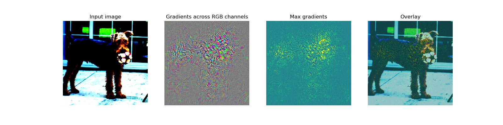

#  Deep Inside Convolutional Networks: Visualising Image Classification Models and Saliency Maps  复现


# 一、简介

Deep Inside Convolutional Networks 这篇论文是由Karen Simonyan等人提出的，可视化结果可以用于知道哪些变量对于模型来说是重要的，在文章中有两种可视化方法，一个是Saliency map即特征图，一个是最大化图像分类图。

**论文**: [Deep Inside Convolutional Networks: Visualising Image Classification Models and Saliency Maps](https://arxiv.org/pdf/1312.6034v2.pdf)


# 二、复现结果


### Saliency Map 方法

| paddle:                                           |
| ------------------------------------------------- |
|  |

测试图像存放在 content/images/ 下，可视化图像存放在images/method_1/ 下。


### Class Specific Image Generation 方法

| Paddle:                                                 |
| ------------------------------------------------------- |
|  |

可视化图像存放在images/method_2/ 下。


# 三、环境依赖

* 硬件：GPU、CPU
* 框架：
  * PaddlePaddle >= 2.00


# 四、快速开始

### Step1： clone

```bash
# clone this repo
git clone https://github.com/632652101/VisualizeCNN-Pd.git
cd Visualize-Pd
exprot PYTHONPATH=./
```


### Step2：安装依赖

```bash
pip install paddlepaddle
```


### Step3：下载权重文件

AlexNet的模型权重文件[在此](https://pan.baidu.com/s/1HkRrEsjpn1iQMAYVeNSeAQ)下载（百度网盘提取码： wgc6）。下载后将权重放到 weights/ 下。


### Step4：运行程序

```bash
# 运行 paddle paddle 程序
python method_1_pp.py
python method_2_pp.py
```

此时程序会将结果图片存放到 images/ 文件夹下。


# 五、模型信息

关于模型的其他信息，可以参考下表：

| 信息     | 说明                                                         |
| -------- | ------------------------------------------------------------ |
| 发布者   | Qijing Yuan                                                  |
| 时间     | 2021.10                                                      |
| 框架版本 | 2.1.3                                                        |
| 应用场景 | AlexNet 可视化                                               |
| 支持硬件 | CPU、GPU                                                     |
| 下载链接 | [预训练模型](https://pan.baidu.com/s/1HkRrEsjpn1iQMAYVeNSeAQ) |
| 在线运行 | [NoteBook](https://aistudio.baidu.com/aistudio/projectdetail/2512233?contributionType=1) |


# 六、其他

### 参考 repo

[FlashTorch](https://github.com/MisaOgura/flashtorch) A Python visualization toolkit, built with PyTorch, for neural networks in PyTorch.

**注***：本repo主要实现了Saliency Maps，参考repo中实现了 guided backpropagation 方法，该方法出自论文，Striving for Simplicity: The All Convolutional Net <https://arxiv.org/pdf/1412.6806.pdf>， 本repo没有实现该方法。
